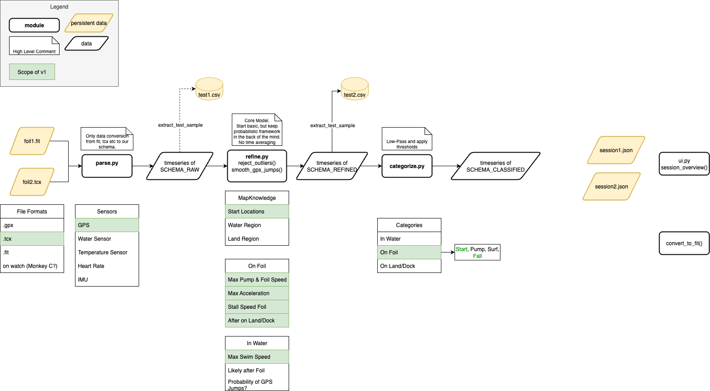

# Pumpfoilysis 🏄‍♂️

Pumpfoilysis is a Python tool designed to analyze GPS activity files to automatically identify and extract pump foiling sessions within the activity. It parses raw sensor data, refines it, classifies different states of activity, and saves the results in an accessible format.

-----

## Core Functionality

The data processing follows a sequential pipeline:

1.  **Parse**: Adapter layer for different file sources (.tcx, .gpx, .fit). Converts to a timeseries dataframe.
2.  **Refine**: Cleans the raw data. Calculates key metrics like velocity and distance per step.
3.  **Categorize**: Classifies sections.

-----

## Architecture Overview

The project is built with a modular architecture that separates each stage of the data processing pipeline.

The following diagram illustrates the high-level data flow from raw files to classified session data:


## Targets
For MVP v1.0
- [ ] Convert `.tcx` files to Polars DataFrame
- [ ] GPS Outlier Detection
- [ ] Data Structures for Priors
- [ ] On Foil Detection Algorithm using GPS and Priors
- [ ] Provide Foil Session Summary Statistics
- [ ] Refined Data Export

-----

## Development

### Tech Stack

Each dependency should resolve a clear purpose.

- Language: Python
- Core Data Library: Polars
- Dependency Management: `uv`
- Linting & Formatting: `ruff`
- Testing: `pytest`

### Setup and Usage

First, ensure you have `uv` installed. Then, clone the repository and set up the environment.

1.  **Install dependencies:**
```bash
uv sync
```
2.  **Run the main application:**
```bash
uv run main.py
```
3.  **Run tests:**
```bash
uv run pytest
```
4.  **Lint and format code:**
```bash
uv run ruff check .
uv run ruff format .
```